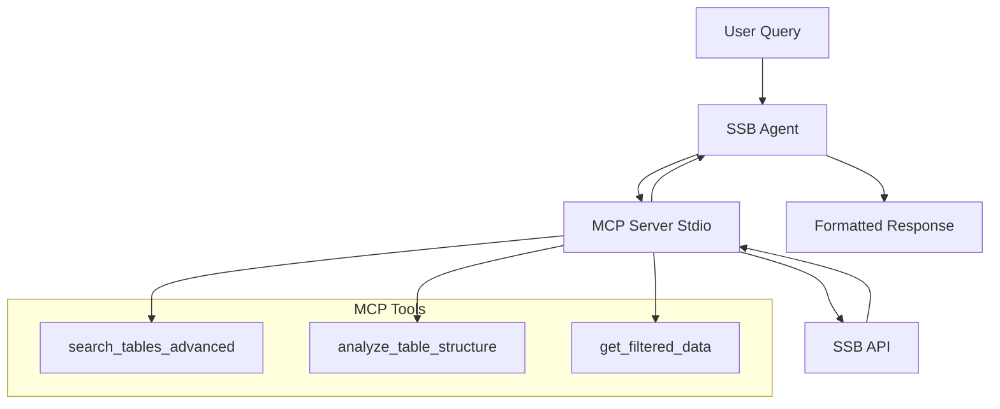

# MCP Implementation with OpenAI Agents SDK - Complete Guide

## Overview

This guide explains how to implement Model Context Protocol (MCP) servers with the OpenAI Agents SDK, specifically focusing on our SSB (Statistics Norway) statistical data system. The implementation follows the patterns described in the [official OpenAI Agents MCP documentation](https://openai.github.io/openai-agents-js/guides/mcp/).

## What is MCP?

The **Model Context Protocol (MCP)** is an open protocol that standardizes how applications provide tools and context to LLMs. As described in the OpenAI documentation:

> MCP is an open protocol that standardizes how applications provide context to LLMs. Think of MCP like a USB-C port for AI applications. Just as USB-C provides a standardized way to connect your devices to various peripherals and accessories, MCP provides a standardized way to connect AI models to different data sources and tools.

## MCP Server Types

The OpenAI Agents SDK supports three types of MCP servers:

| Server Type | Description | Use Case |
|-------------|-------------|----------|
| **Hosted MCP Tools** | Remote MCP servers used as tools by OpenAI Responses API | Publicly accessible remote servers with default OpenAI models |
| **Streamable HTTP** | Local or remote servers using Streamable HTTP transport | Local servers or when you need local tool call triggering |
| **Stdio** | Servers accessed via standard input/output | Local MCP servers, simplest option |

**Our Implementation**: We use **Stdio** because our MCP server runs locally and integrates directly with the SSB API.

## Architecture Overview



## Implementation Components

### 1. MCP Server (mcp_server.py)

The MCP server provides three specialized tools for SSB data access:

```python
from fastmcp import FastMCP
from pydantic import Field

# Create FastMCP server
mcp = FastMCP("Enhanced SSB Discovery")

@mcp.tool()
async def search_tables_advanced(
    query: str = Field(description="Search query for SSB statistical tables"),
    language: str = Field(default="no", pattern="^(no|en)$"),
    max_results: int = Field(default=20, le=50)
) -> dict:
    """Advanced search for SSB statistical tables with enhanced filtering."""
    # Implementation details...

@mcp.tool()
async def analyze_table_structure(
    table_id: str = Field(description="SSB table identifier"),
    language: str = Field(default="no", pattern="^(no|en)$")
) -> dict:
    """Analyze table structure and provide detailed metadata."""
    # Implementation details...

@mcp.tool()
async def get_filtered_data(
    table_id: str = Field(description="SSB table identifier"),
    filters: dict = Field(description="Dimension filters as JSON object"),
    language: str = Field(default="no", pattern="^(no|en)$"),
    max_data_points: int = Field(default=100, le=1000)
) -> dict:
    """Get filtered statistical data with flexible dimension selection."""
    # Implementation details...
```

**Key Features:**
- **Rate Limiting**: Respects SSB's 30 queries per 10-minute window
- **Caching**: 4-hour TTL for statistical data
- **Error Handling**: Robust retry logic with exponential backoff
- **Data Processing**: Converts JSON-stat2 format to structured data

### 2. Agent Implementation (ssb_agent_mcp.py)

The agent integrates with the MCP server using the OpenAI Agents SDK:

```python
from agents import Agent, run, set_default_openai_client, set_tracing_disabled
from agents.mcp import MCPServerStdio, MCPServerStdioParams
import openai

class SSBAgent:
    def __init__(self):
        # Configure Azure OpenAI
        azure_client = openai.AsyncAzureOpenAI(
            api_key=os.getenv("AZURE_OPENAI_API_KEY"),
            api_version=os.getenv("AZURE_OPENAI_API_VERSION"),
            azure_endpoint=os.getenv("AZURE_OPENAI_ENDPOINT")
        )
        
        set_default_openai_client(azure_client)
        set_tracing_disabled(True)
        
        # Initialize MCP server
        params = MCPServerStdioParams(
            command=sys.executable,
            args=["mcp_server.py"]
        )
        
        self.mcp_server = MCPServerStdio(
            params=params,
            name="SSB Statistics MCP Server",
            cache_tools_list=True
        )
    
    async def process_query(self, query: str) -> str:
        await self.mcp_server.connect()
        try:
                         agent = Agent(
                 name="SSB Statistical Expert",
                 instructions="...",  # Detailed instructions
                 model="o3-mini",
                 mcp_servers=[self.mcp_server]
             )
            
            response = await run(agent, query)
            return response.final_output
        finally:
            await self.mcp_server.close()
```

## Key Implementation Patterns

### 1. MCP Server Connection Management

**Correct Pattern:**
```python
await mcp_server.connect()
try:
    # Use the server
    agent = Agent(mcp_servers=[mcp_server])
    response = await run(agent, query)
finally:
    await mcp_server.close()
```

**Wrong Pattern:**
```python
# This doesn't work with the OpenAI Agents SDK
async with mcp_server:
    # Operations
```

### 2. Parameter Configuration

**MCPServerStdio requires MCPServerStdioParams:**
```python
# Correct
params = MCPServerStdioParams(
    command=sys.executable,
    args=["mcp_server.py"]
)
server = MCPServerStdio(params=params)

# Wrong
server = MCPServerStdio(
    command=sys.executable,  # This will fail
    args=["mcp_server.py"]
)
```

### 3. Tool Caching

Enable tool caching for better performance:
```python
server = MCPServerStdio(
    params=params,
    cache_tools_list=True  # Caches tool discovery
)
```

### 4. Agent Configuration

```python
agent = Agent(
    name="Domain Expert",
    instructions="Detailed instructions...",
    model="o3-mini",
    mcp_servers=[mcp_server]  # List of MCP servers
)
```

## Advanced Features

### 1. Tool Filtering

Restrict which tools are exposed:
```python
from agents.mcp import create_static_tool_filter

server = MCPServerStdio(
    params=params,
    tool_filter=create_static_tool_filter({
        'allowed': ['search_tables_advanced', 'analyze_table_structure'],
        'blocked': ['dangerous_tool']
    })
)
```

### 2. Human-in-the-Loop (HITL)

For sensitive operations requiring approval:
```python
result = await run(agent, query)

while result.interruptions:
    for interruption in result.interruptions:
        # Human approval logic
        approval = await get_human_approval(interruption)
        if approval:
            result.state.approve(interruption)
        else:
            result.state.reject(interruption)
    
    result = await run(agent, result.state)
```

### 3. Streaming Responses

```python
result = await run(agent, query, stream=True)

for event in result:
    if event.type == 'text_output':
        print(event.data, end='', flush=True)

print(f"\nFinal result: {result.final_output}")
```

## Error Handling Best Practices

### 1. Connection Errors

```python
try:
    await mcp_server.connect()
except Exception as e:
    logger.error(f"Failed to connect to MCP server: {e}")
    # Fallback behavior
```

### 2. Tool Execution Errors

```python
# The agent framework handles tool errors automatically
# but you can customize error handling in your MCP tools:

@mcp.tool()
async def my_tool(param: str) -> dict:
    try:
        result = await external_api_call(param)
        return {"success": True, "data": result}
    except Exception as e:
        return {
            "success": False,
            "error": str(e),
            "suggestion": "Try a different parameter"
        }
```

### 3. Rate Limiting

```python
class RateLimiter:
    def __init__(self, max_calls=25, time_window=600):
        self.max_calls = max_calls
        self.time_window = time_window
        self.calls = []
    
    async def acquire(self):
        now = datetime.now()
        self.calls = [call for call in self.calls 
                     if call > now - timedelta(seconds=self.time_window)]
        
        if len(self.calls) >= self.max_calls:
            sleep_time = self.time_window - (now - self.calls[0]).total_seconds()
            if sleep_time > 0:
                await asyncio.sleep(sleep_time)
        
        self.calls.append(now)
```

## Testing Strategy

### 1. Unit Testing MCP Tools

```python
import pytest
from mcp_server import search_tables_advanced

@pytest.mark.asyncio
async def test_search_tables():
    result = await search_tables_advanced("befolkning", "no", 5)
    
    assert "tables" in result
    assert len(result["tables"]) <= 5
    assert result["query"] == "befolkning"
```

### 2. Integration Testing

```python
@pytest.mark.asyncio
async def test_agent_integration():
    agent = SSBAgent()
    response = await agent.process_query("befolkning")
    
    assert "📊 Data Summary" in response
    assert "Statistics Norway" in response
```

### 3. MCP Server Testing

```python
async def test_mcp_server_connectivity():
    params = MCPServerStdioParams(command="python", args=["mcp_server.py"])
    server = MCPServerStdio(params=params)
    
    await server.connect()
    try:
        tools = await server.list_tools()
        assert len(tools) == 3  # Our three tools
    finally:
        await server.close()
```

## Performance Optimization

### 1. Connection Pooling

For multiple queries, reuse the MCP server connection:
```python
class SSBAgentPool:
    def __init__(self):
        self.mcp_server = None
    
    async def __aenter__(self):
        # Initialize and connect once
        params = MCPServerStdioParams(...)
        self.mcp_server = MCPServerStdio(params=params)
        await self.mcp_server.connect()
        return self
    
    async def __aexit__(self, exc_type, exc_val, exc_tb):
        if self.mcp_server:
            await self.mcp_server.close()
    
    async def process_query(self, query: str) -> str:
        agent = Agent(mcp_servers=[self.mcp_server])
        response = await run(agent, query)
        return response.final_output
```

### 2. Caching Strategy

```python
# Enable tool list caching
server = MCPServerStdio(
    params=params,
    cache_tools_list=True
)

# Implement response caching in MCP tools
cache = {}

@mcp.tool()
async def cached_search(query: str) -> dict:
    if query in cache:
        return cache[query]
    
    result = await perform_search(query)
    cache[query] = result
    return result
```

## Deployment Considerations

### 1. Environment Variables

```bash
# Required for Azure OpenAI
AZURE_OPENAI_API_KEY=your_api_key
AZURE_OPENAI_ENDPOINT=https://your-resource.openai.azure.com/
AZURE_OPENAI_API_VERSION=2025-04-01-preview
AZURE_OPENAI_O3MINI_DEPLOYMENT=o3-mini

# Optional
AGENTS_DISABLE_TRACING=true
```

### 2. Docker Deployment

```dockerfile
FROM python:3.13-slim

WORKDIR /app
COPY requirements.txt .
RUN pip install -r requirements.txt

COPY . .

CMD ["python", "ssb_agent_mcp.py"]
```

### 3. Production Monitoring

```python
import logging
from agents import set_trace_processors

# Enable tracing in production
set_tracing_disabled(False)
set_trace_processors([
    # Add your tracing processors
])

# Configure logging
logging.basicConfig(
    level=logging.INFO,
    format='%(asctime)s - %(name)s - %(levelname)s - %(message)s'
)
```

## Common Pitfalls and Solutions

### 1. Wrong Import Paths

**Problem:**
```python
from agents.mcp import MCPServerStdio  # Wrong, missing params
```

**Solution:**
```python
from agents.mcp import MCPServerStdio, MCPServerStdioParams
```

### 2. Incorrect Parameter Format

**Problem:**
```python
server = MCPServerStdio(command="python", args=["script.py"])
```

**Solution:**
```python
params = MCPServerStdioParams(command="python", args=["script.py"])
server = MCPServerStdio(params=params)
```

### 3. Connection Management

**Problem:**
```python
# Forgetting to close connections
await server.connect()
# ... use server ...
# Missing: await server.close()
```

**Solution:**
```python
await server.connect()
try:
    # Use server
    pass
finally:
    await server.close()
```

### 4. Tool Registration Issues

**Problem:**
```python
# Tools not being discovered
@mcp.tool()
def sync_tool():  # Synchronous function
    return {}
```

**Solution:**
```python
@mcp.tool()
async def async_tool():  # Must be async
    return {}
```

## Best Practices Summary

1. **Always use async/await** for MCP operations
2. **Properly manage connections** with try/finally blocks
3. **Enable tool caching** for better performance
4. **Implement robust error handling** in MCP tools
5. **Use structured responses** for better agent understanding
6. **Respect API rate limits** with proper throttling
7. **Cache expensive operations** when possible
8. **Provide clear tool descriptions** and parameter validation
9. **Test both unit and integration scenarios**
10. **Monitor performance and errors** in production

## Conclusion

The OpenAI Agents SDK provides a powerful framework for implementing MCP servers. Our SSB implementation demonstrates how to:

- Create specialized domain tools (statistical data access)
- Integrate with external APIs (SSB PxWebAPI)
- Handle complex data transformations
- Provide intelligent query suggestions
- Maintain good performance with caching and rate limiting

The key to success is following the SDK patterns correctly, implementing robust error handling, and providing clear, structured responses that enable the agent to deliver valuable insights to users.

## References

- [OpenAI Agents MCP Documentation](https://openai.github.io/openai-agents-js/guides/mcp/)
- [Model Context Protocol Specification](https://modelcontextprotocol.io/)
- [SSB PxWebAPI Documentation](https://www.ssb.no/api)
- [FastMCP Documentation](https://github.com/jlowin/fastmcp) 